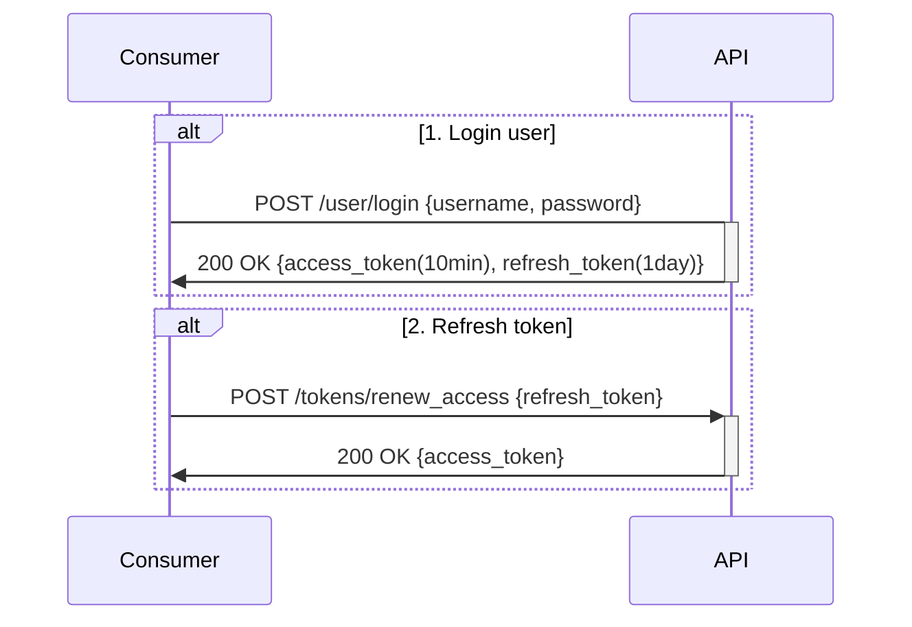

# łukasz Bank

## login and session handling

```mermaid
sequenceDiagram
alt 1. Login user
    Consumer->+API: POST /user/login {username, password}
    API->>-Consumer: 200 OK {access_token(10min), refresh_token(1day)}
end

alt 2. Refresh token
    Consumer->>+API: POST /tokens/renew_access {refresh_token}
        API->>-Consumer: 200 OK {access_token}
end
```
