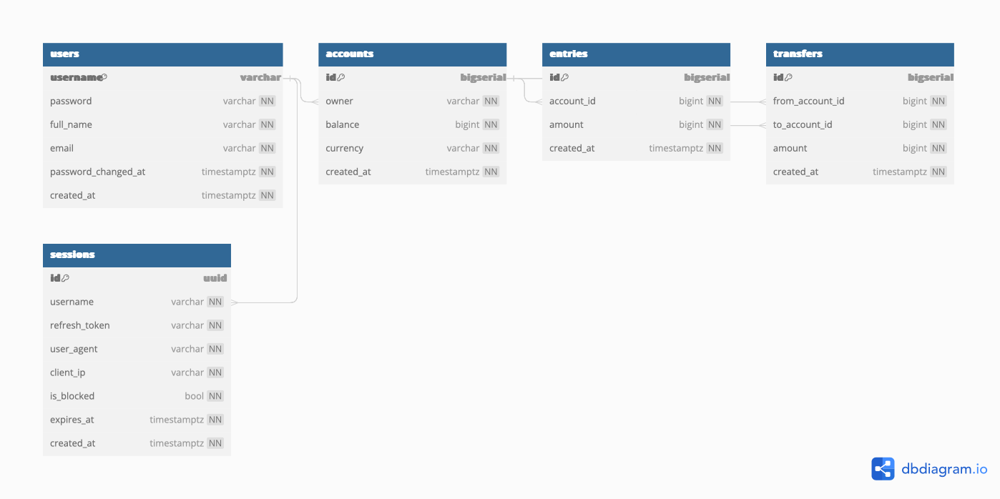

# łukasz Bank

## Database

Database is design using [dbdiagram.io](https://dbdiagram.io/) tools

### Database schema

Detailed database documentation can be found:
 [https://dbdocs.io/AdamDomagalsky/Bank](https://dbdocs.io/AdamDomagalsky/Bank)

## login and session handling

